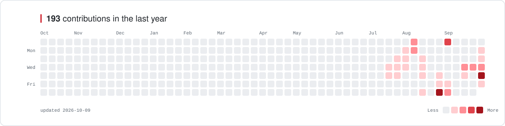

<picture>
  <source media="(prefers-color-scheme: dark)" srcset="assets/banner-dark.svg">
  
</picture>

<picture>
  <source media="(prefers-color-scheme: dark)" srcset="assets/contrib-dark.svg">
  
</picture>

 

I work on the part of navigation that starts when GPS stops being trustworthy — **detecting, characterizing and defeating GNSS jamming and spoofing**, and keeping position and time alive while someone is actively trying to take them away. Most of my work lives between the receiver, the RF bench and the tools that make sense of both.

 

### Tools

         

### Selected work

<a href="https://github.com/louzinio/javad-logger">
  <picture>
    <source media="(prefers-color-scheme: dark)" srcset="https://github-readme-stats.vercel.app/api/pin/?username=louzinio&repo=javad-logger&theme=github_dark&hide_border=true&bg_color=0d1117">
    
  </picture>
</a>

 

<picture>
  <source media="(prefers-color-scheme: dark)" srcset="https://github-readme-stats.vercel.app/api/top-langs/?username=louzinio&layout=compact&theme=github_dark&hide_border=true&bg_color=0d1117&langs_count=6">
  
</picture>

 

